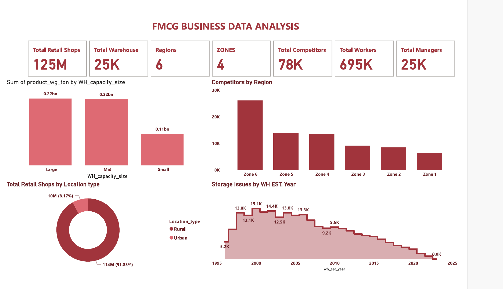

# 📦 FMCG Business Data Analysis

## 📘 Overview

This dashboard presents a strategic analysis of the Fast-Moving Consumer Goods (FMCG) industry. It covers **retail distribution**, **warehouse capacity**, **regional competitiveness**, and **storage issues**—critical for logistics managers, supply chain analysts, and FMCG executives.

---

## 📊 Key Metrics

* 🏬 **Total Retail Shops**: 125M
* 🏢 **Total Warehouses**: 25K
* 🌍 **Regions**: 6
* 📍 **Zones**: 4
* ⚔ **Total Competitors**: 78K
* 👷 **Total Workers**: 695K
* 👨‍💼 **Total Managers**: 25K

---

## 📈 Visual Insights

### 🏗 Product Weight by Warehouse Capacity

* Large & Mid-size warehouses both handle **0.22B tons**, while Small warehouses manage **0.11B tons**.

### 🏬 Retail Location Distribution

* **Urban Shops** dominate with **114M (91.83%)**
* **Rural Shops** account for only **10M (8.17%)**

### ⚔ Competitor Spread by Region

* **Zone 6** is the most competitive (\~25K competitors)
* **Zone 1** has the fewest (\~8K)

### 🧱 Storage Issues by Warehouse Establishment Year

* Storage issues peaked in **2001 (15.1K incidents)**
* Gradual decline post-2010, hitting **0 by 2024**, indicating improved storage standards or reduced reporting

---

## 🛠️ Built With

* Power BI for advanced business visualization
* FMCG operational and warehouse datasets

---

## 💡 Use Cases

* **Competitive Analysis**: Identify heavily saturated zones
* **Warehouse Planning**: Optimize based on past storage issue trends
* **Retail Location Strategy**: Expand into underrepresented rural areas
* **Historical Issue Trends**: Evaluate warehouse lifecycle performance

